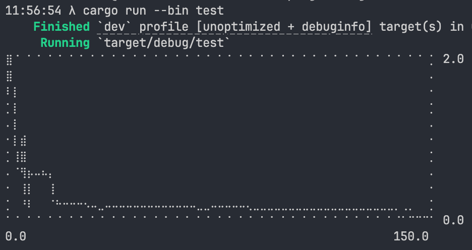

# Galapagos

Simple evolutionary solver written in Rust.

## Usage

```rust
use matrix_rs::galapagos::{self, Goal};

fn main() {
    let solution = galapagos::solve(
        |xs| {
            // Rosenbrock: (a - x)^2 + b(y - x^2)^2
            let x = xs[0];
            let y = xs[1];
            (1.0 - x).powi(2) + 100.0 * (y - x.powi(2)).powi(2)
        },
        vec![(-5.0, 5.0), (-5.0, 5.0)],
        Goal::Minimize,
        Default::default(),
    );
    println!("{solution:?}");
}
```

## History

You can optionally export the fitness of each generation with `record_history`.



```rust
use matrix_rs::galapagos::{self, Config, Goal};
use textplots::{Chart, Plot};

fn main() {
    let solution = galapagos::solve(
        |xs| {
            // Rosenbrock: (a - x)^2 + b(y - x^2)^2
            let x = xs[0];
            let y = xs[1];
            (1.0 - x).powi(2) + 100.0 * (y - x.powi(2)).powi(2)
        },
        vec![(-5.0, 5.0), (-5.0, 5.0)],
        Goal::Minimize,
        Config {
            population_size: 200,
            generation_count: 150,
            record_history: true,
            ..Default::default()
        },
    );
    let history = solution.history.unwrap();
    Chart::new(120, 40, 0.0, history.len() as f32)
        .lineplot(&textplots::Shape::Lines(&history))
        .nice();
}
```